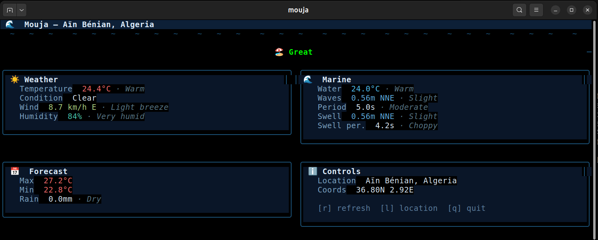

# 🌊 Mouja

A terminal UI that shows your local beach conditions and weather with human-friendly explanations. Built with Go + [Bubble Tea](https://github.com/charmbracelet/bubbletea).

_Mouja means "wave" in Algerian Arabic._

## Usage

```bash
mouja                              # default location (Aïn Bénian, Algeria)
mouja 36.8 2.92                    # by coordinates
mouja 36.8 2.92 "My Beach"        # with custom name
```

### Controls

| Key | Action                    |
|-----|---------------------------|
| `l` | Change location (in-app)  |
| `r` | Refresh data              |
| `q` | Quit                      |

Press `l` to open the location switcher, then type coordinates like `36.8, 2.92, Beach Name`.

### Example output



## Data

Powered by [Open-Meteo](https://open-meteo.com/) — free weather & marine APIs, no API key required.

- **Weather**: temperature, humidity, wind speed/direction, conditions
- **Marine**: wave height/direction/period, swell, water temperature
- **Forecast**: daily max/min temperature, precipitation

## Install

### From source

```bash
git clone https://github.com/D3epX/Mouja.git
cd Mouja
go build -o mouja .
./mouja
```

### Via Go

```bash
go install github.com/D3epX/Mouja@latest
```

## License

MIT
